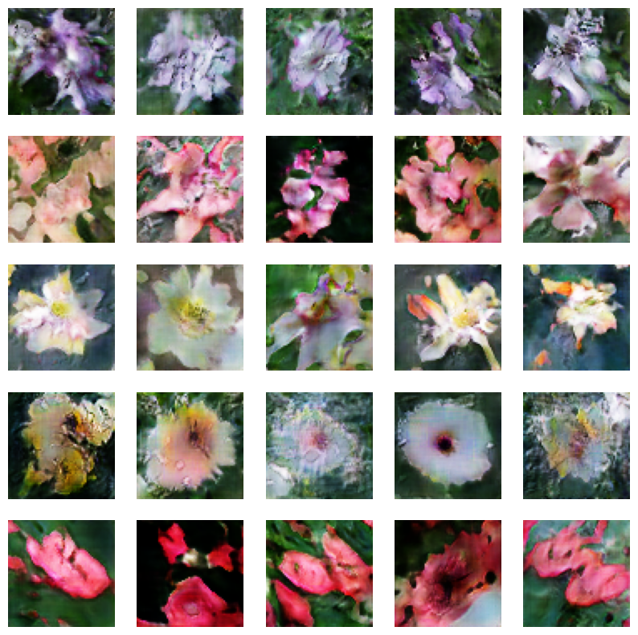

# Caption to Image Generator
This is a deep learning project that gets the caption of an image and then generate an image from the caption. GAN model are used to generate the image and a text encoder are used to encode the text and fed it into the GAN model. The model used more specifically is written in model part below.

## Dataset
The dataset used is the [oxford 102 flower dataset](https://www.robots.ox.ac.uk/~vgg/data/flowers/102/). However the data that we used has already been annotated a bit differently.

## Model
Text encoder : [Bert](https://huggingface.co/sentence-transformers/all-mpnet-base-v2) newest pre-trained model at that time

GAN : [DF-GAN](https://openaccess.thecvf.com/content/CVPR2022/papers/Tao_DF-GAN_A_Simple_and_Effective_Baseline_for_Text-to-Image_Synthesis_CVPR_2022_paper.pdf), We implemented it based on the paper the link directed to called "DF-GAN: A Simple and Effective Baseline for Text-to-Image Synthesis" 

## Data Augmentation
There are 2 different data augmentation written in the ipynb file. 
- First method : choose random captions as there are 8-10 of them for one image. Then, random crop and random horizontal flip for the image. This is an online algorithm as the that captions gets randomly chosen is different every time for every epoch.  
- Second method : Increase the dataset size by picking 4 random captions, get their embeddings, and do rotation and random horizontal flip for the image and then do it for another 3 times. So, the dataset becomes 3 times more than the original

## Result

